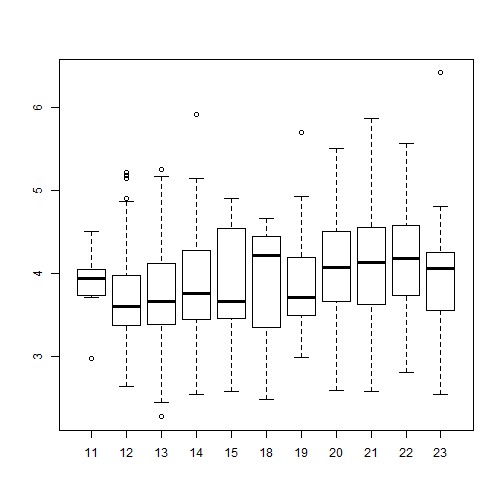

## TOTVS Labs - AI Challenge

This repository analyzes a dataset for the [TOTVS Lead Data Scientist](https://github.com/TOTVS/MDMStatic/tree/master/code-challenge) position, using R.

### Parse and extract the data.

The dataset contains transactions from a restaurant.  The file appears to be in JSON format.

A potential challenge in reading this data from JSON is that each bill can have multiple items on it.  The fromJSON() function of the jsonlite package reads in the file as nested dataframes.  

```r
library(jsonlite)
df <- fromJSON("sample.txt")
dim(df)
```

```
## [1] 1635    7
```

```r
names(df)
```

```
## [1] "complemento"     "dets"            "emit"            "ide"            
## [5] "infAdic"         "total"           "versaoDocumento"
```

The total on the bill, for example, is df$complemento$valorTotal

```r
head(df$complemento$valorTotal)
```

```
## [1] 24.90 92.53 57.86 34.97 46.23 32.76
```

This is a bit of a pain to work with, but we can flatten the data frame:

```r
dfflat <- flatten(df, recursive = TRUE)
names(dfflat)
```

```
##  [1] "dets"                     "versaoDocumento"         
##  [3] "complemento.valorTotal"   "emit.cnpj"               
##  [5] "emit.xFant"               "emit.enderEmit.fone"     
##  [7] "emit.enderEmit.xBairro"   "emit.enderEmit.xLgr"     
##  [9] "emit.enderEmit.xMun"      "emit.enderEmit.xPais"    
## [11] "emit.enderEmit.uf"        "ide.natOp"               
## [13] "ide.dhEmi.$date"          "infAdic.infCpl"          
## [15] "total.icmsTot.vDesc"      "total.icmsTot.vFrete"    
## [17] "total.icmsTot.vOutro"     "total.icmsTot.vProd"     
## [19] "total.icmsTot.vSeg"       "total.icmsTot.vTotTrib"  
## [21] "total.icmsTot.vbc"        "total.icmsTot.vbcst"     
## [23] "total.icmsTot.vcofins"    "total.icmsTot.vicms"     
## [25] "total.icmsTot.vicmsDeson" "total.icmsTot.vii"       
## [27] "total.icmsTot.vipi"       "total.icmsTot.vnf"       
## [29] "total.icmsTot.vpis"       "total.icmsTot.vst"
```

The values of the dets column are lists of data frames; the items on the first bill, for example, are

```r
df$dets[[1]]
```

```
##   nItem prod.indTot prod.qCom prod.uCom prod.vProd prod.vUnCom prod.xProd
## 1     1           1     1.000        UN        3.5         3.5       AGUA
## 2     2           1     0.312        KG       21.4        68.6     BUFFET
```

versaoDocumento is also, somewhat oddly, I thought, a list of data frames, but appears to have all 1 values

```r
summary(as.numeric(matrix(unlist(dfflat$versaoDocumento),ncol=1,byrow = TRUE)[,1]))
```

```
##    Min. 1st Qu.  Median    Mean 3rd Qu.    Max. 
##       1       1       1       1       1       1
```

A quick summary of the other numeric columns shows that several columns are constant and can be dropped from further analysis.  total.icmsTot.vProd is nearly identical to valorTotal, so we'll drop that, too.

```r
summary(dfflat[3:30])
```

```
##  complemento.valorTotal  emit.cnpj          emit.xFant       
##  Min.   :  9.74         Length:1635        Length:1635       
##  1st Qu.: 30.98         Class :character   Class :character  
##  Median : 43.26         Mode  :character   Mode  :character  
##  Mean   : 55.50                                              
##  3rd Qu.: 69.23                                              
##  Max.   :608.91                                              
##  emit.enderEmit.fone emit.enderEmit.xBairro emit.enderEmit.xLgr
##  Length:1635         Length:1635            Length:1635        
##  Class :character    Class :character       Class :character   
##  Mode  :character    Mode  :character       Mode  :character   
##                                                                
##                                                                
##                                                                
##  emit.enderEmit.xMun emit.enderEmit.xPais emit.enderEmit.uf 
##  Length:1635         Length:1635          Length:1635       
##  Class :character    Class :character     Class :character  
##  Mode  :character    Mode  :character     Mode  :character  
##                                                             
##                                                             
##                                                             
##   ide.natOp         ide.dhEmi.$date    infAdic.infCpl    
##  Length:1635        Length:1635        Length:1635       
##  Class :character   Class :character   Class :character  
##  Mode  :character   Mode  :character   Mode  :character  
##                                                          
##                                                          
##                                                          
##  total.icmsTot.vDesc total.icmsTot.vFrete total.icmsTot.vOutro
##  Min.   :0.000000    Min.   :0            Min.   :0           
##  1st Qu.:0.000000    1st Qu.:0            1st Qu.:0           
##  Median :0.000000    Median :0            Median :0           
##  Mean   :0.001352    Mean   :0            Mean   :0           
##  3rd Qu.:0.000000    3rd Qu.:0            3rd Qu.:0           
##  Max.   :1.210000    Max.   :0            Max.   :0           
##  total.icmsTot.vProd total.icmsTot.vSeg total.icmsTot.vTotTrib
##  Min.   :  9.74      Min.   :0          Min.   :  0.410       
##  1st Qu.: 30.98      1st Qu.:0          1st Qu.:  2.250       
##  Median : 43.27      Median :0          Median :  3.560       
##  Mean   : 55.51      Mean   :0          Mean   :  4.896       
##  3rd Qu.: 69.23      3rd Qu.:0          3rd Qu.:  5.825       
##  Max.   :608.96      Max.   :0          Max.   :122.480       
##  total.icmsTot.vbc total.icmsTot.vbcst total.icmsTot.vcofins
##  Min.   :0         Min.   :0           Min.   :0            
##  1st Qu.:0         1st Qu.:0           1st Qu.:0            
##  Median :0         Median :0           Median :0            
##  Mean   :0         Mean   :0           Mean   :0            
##  3rd Qu.:0         3rd Qu.:0           3rd Qu.:0            
##  Max.   :0         Max.   :0           Max.   :0            
##  total.icmsTot.vicms total.icmsTot.vicmsDeson total.icmsTot.vii
##  Min.   :0           Min.   :0                Min.   :0        
##  1st Qu.:0           1st Qu.:0                1st Qu.:0        
##  Median :0           Median :0                Median :0        
##  Mean   :0           Mean   :0                Mean   :0        
##  3rd Qu.:0           3rd Qu.:0                3rd Qu.:0        
##  Max.   :0           Max.   :0                Max.   :0        
##  total.icmsTot.vipi total.icmsTot.vnf total.icmsTot.vpis total.icmsTot.vst
##  Min.   :0          Min.   :  9.32    Min.   :0          Min.   :0        
##  1st Qu.:0          1st Qu.: 29.69    1st Qu.:0          1st Qu.:0        
##  Median :0          Median : 40.88    Median :0          Median :0        
##  Mean   :0          Mean   : 52.44    Mean   :0          Mean   :0        
##  3rd Qu.:0          3rd Qu.: 66.42    3rd Qu.:0          3rd Qu.:0        
##  Max.   :0          Max.   :551.16    Max.   :0          Max.   :0
```

The following text columns, with the exception of infAdic.infCpl, which appears to be the table number at which the customers are seated, are also constant, and can be dropped from analysis.

```r
table(dfflat$emit.cnpj)
```

```
## 
## 01.234.567/0001-89 
##               1635
```

```r
table(dfflat$emit.xFant)
```

```
## 
## TOTVS Labs 
##       1635
```

```r
table(dfflat$emit.enderEmit.fone)
```

```
## 
## 1-650-933-4902 
##           1635
```

```r
table(dfflat$emit.enderEmit.xBairro)
```

```
## 
##      
## 1635
```

```r
table(dfflat$emit.enderEmit.xLgr)
```

```
## 
## 650 Castro St. unit 210 
##                    1635
```

```r
table(dfflat$emit.enderEmit.xMun)
```

```
## 
## Mountain View 
##          1635
```

```r
table(dfflat$emit.enderEmit.xPais)
```

```
## 
## United States 
##          1635
```

```r
table(dfflat$emit.enderEmit.uf)
```

```
## 
##   CA 
## 1635
```

```r
table(dfflat$ide.natOp)
```

```
## 
## VENDA 
##  1635
```

```r
table(dfflat$infAdic.infCpl)
```

```
## 
##  Mesa 1 Mesa 10 Mesa 11 Mesa 13 Mesa 14 Mesa 15 Mesa 16 Mesa 17 Mesa 18 
##      24      24      22      23      23      18      23      23      22 
## Mesa 19  Mesa 2 Mesa 21 Mesa 22 Mesa 23 Mesa 24 Mesa 25 Mesa 26 Mesa 27 
##      22      23      24      26      22      23      22      22      21 
## Mesa 28 Mesa 29  Mesa 3 Mesa 30 Mesa 33 Mesa 35 Mesa 36 Mesa 37 Mesa 38 
##      22      15      21      23      23      23      25      21      20 
##  Mesa 4 Mesa 40 Mesa 41 Mesa 42 Mesa 43 Mesa 44 Mesa 46 Mesa 47  Mesa 5 
##      24      23      20      20      23      21      21      22      24 
## Mesa 51 Mesa 53 Mesa 55 Mesa 56 Mesa 57 Mesa 58 Mesa 59  Mesa 6 Mesa 60 
##      20      22      19      21      22      18      20      22      22 
## Mesa 61 Mesa 63 Mesa 64 Mesa 66 Mesa 67 Mesa 68 Mesa 69  Mesa 7 Mesa 70 
##      22      20      22      21      20      18      15      24      19 
## Mesa 71 Mesa 72 Mesa 73 Mesa 75 Mesa 76 Mesa 77 Mesa 78  Mesa 8 Mesa 80 
##      21      22      17      22      23      18      14      22      19 
## Mesa 81 Mesa 82 Mesa 83 Mesa 84 Mesa 85 Mesa 86 Mesa 87 Mesa 88 Mesa 89 
##      20      18      14      16      12      18      16      16      15 
##  Mesa 9 Mesa 90 Mesa 91 Mesa 92 Mesa 93 Mesa 94 Mesa 95 Mesa 96 Mesa 97 
##      22      16      10      15      12      10      14      13      11 
## Mesa 98 Mesa 99 
##      11      13
```


After dropping the constant columns, we're left with  

```r
drops <- c("versaoDocumento", "total.icmsTot.vFrete", "total.icmsTot.vOutro", "total.icmsTot.vSeg", "total.icmsTot.vbc", "total.icmsTot.vbcst", "total.icmsTot.vcofins", "total.icmsTot.vicms", "total.icmsTot.vicmsDeson", "total.icmsTot.vii", "total.icmsTot.vipi", "total.icmsTot.vpis", "total.icmsTot.vst", "emit.cnpj", "emit.xFant", "emit.enderEmit.fone", "emit.enderEmit.xBairro", "emit.enderEmit.xLgr", "emit.enderEmit.xMun", "emit.enderEmit.xPais", "emit.enderEmit.uf","ide.natOp", "total.icmsTot.vProd")
dfready <- dfflat[ , !(names(dfflat) %in% drops)]
summary(dfready[2:7])
```

```
##  complemento.valorTotal ide.dhEmi.$date    infAdic.infCpl    
##  Min.   :  9.74         Length:1635        Length:1635       
##  1st Qu.: 30.98         Class :character   Class :character  
##  Median : 43.26         Mode  :character   Mode  :character  
##  Mean   : 55.50                                              
##  3rd Qu.: 69.23                                              
##  Max.   :608.91                                              
##  total.icmsTot.vDesc total.icmsTot.vTotTrib total.icmsTot.vnf
##  Min.   :0.000000    Min.   :  0.410        Min.   :  9.32   
##  1st Qu.:0.000000    1st Qu.:  2.250        1st Qu.: 29.69   
##  Median :0.000000    Median :  3.560        Median : 40.88   
##  Mean   :0.001352    Mean   :  4.896        Mean   : 52.44   
##  3rd Qu.:0.000000    3rd Qu.:  5.825        3rd Qu.: 66.42   
##  Max.   :1.210000    Max.   :122.480        Max.   :551.16
```
...plus the contents of dets.


### Identify a pattern on any set of fields that can help predict how much a customer will spend.

Does the table at which a person is seated have any effect on their spending?  

```r
mod1 = lm(complemento.valorTotal ~ infAdic.infCpl, data = dfready)
anova(mod1)
```

```
## Analysis of Variance Table
## 
## Response: complemento.valorTotal
##                  Df  Sum Sq Mean Sq F value Pr(>F)
## infAdic.infCpl   82  125560  1531.2  0.9954 0.4924
## Residuals      1552 2387547  1538.4
```
...No.  The p-value for this variable in the model is nowhere near statistically significant.

vDesc, vtotTrib, and vnf all appear to be highly correlated with the final bill, as indicated by their highly statistically significant p-values:

```r
mod2 = lm(complemento.valorTotal ~ total.icmsTot.vDesc + total.icmsTot.vTotTrib + total.icmsTot.vnf, data = dfready)
anova(mod2)
```

```
## Analysis of Variance Table
## 
## Response: complemento.valorTotal
##                          Df  Sum Sq Mean Sq   F value    Pr(>F)    
## total.icmsTot.vDesc       1    1333    1333    20.189 7.507e-06 ***
## total.icmsTot.vTotTrib    1 1736486 1736486 26292.705 < 2.2e-16 ***
## total.icmsTot.vnf         1  667570  667570 10107.890 < 2.2e-16 ***
## Residuals              1631  107718      66                        
## ---
## Signif. codes:  0 '***' 0.001 '**' 0.01 '*' 0.05 '.' 0.1 ' ' 1
```
...but I have no idea what these columns represent.  They aren't exactly components of the final bill, otherwise, their sum would equal the value of the final bill

```r
plot(dfready$complemento.valorTotal,dfready$total.icmsTot.vDesc+dfready$total.icmsTot.vTotTrib+dfready$total.icmsTot.vnf)
```


```r
summary(dfready$complemento.valorTotal-dfready$total.icmsTot.vDesc-dfready$total.icmsTot.vTotTrib-dfready$total.icmsTot.vnf)
```

```
##    Min. 1st Qu.  Median    Mean 3rd Qu.    Max. 
## -64.730  -4.375  -2.960  -1.837  -1.010 124.200
```
Sometimes it's higher, sometimes it's lower, so without further information, I don't feel comfortable using these to predict spending.


There's a similar issue with the dets information:

```r
df$dets[[1]]
```

```
##   nItem prod.indTot prod.qCom prod.uCom prod.vProd prod.vUnCom prod.xProd
## 1     1           1     1.000        UN        3.5         3.5       AGUA
## 2     2           1     0.312        KG       21.4        68.6     BUFFET
```
This has detailed information on each item in the order; with this information, you can perfectly predict the amount of the bill because the bill is just the sum of prod.vProd.  We can't use this to "predict" customer spending; perhaps ideally, we would build a model to predict what a customer will buy based on other variables, but all we have in the way of predictors at this point are the time-based ones, and I don't have enough time to do a market basket analysis in R. 

Okay, given that we're just left with date-time information as possibly useful, let's create some time-based columns we can use for prediction.

```r
library(chron)
dfready$hrs <- hours(strptime(dfready$`ide.dhEmi.$date`, "%Y-%m-%dT%H:%M:%S.000Z"))
dfready$weekdays <- weekdays(strptime(dfready$`ide.dhEmi.$date`, "%Y-%m-%dT%H:%M:%S.000Z"))
dfready$days <- days(strptime(dfflat$`ide.dhEmi.$date`, "%Y-%m-%dT%H:%M:%S.000Z"))
dfready$week <- floor((as.numeric(dfready$days)-4)/7)+1
```

Now let's look at spending by hour of the day

```r
plot(factor(dfready$hrs),dfready$complemento.valorTotal)
```


...hm... I don't like the outlying values. Let's look at the log-transformed response:


```r
plot(factor(dfready$hrs),log(dfready$complemento.valorTotal))
```



That's better, but looking at a table of the hourly information by weekday:


```r
library(data.table)
dt <- data.table(dfready)
dt[order(weekdays,hrs),list(mean=mean(complemento.valorTotal),sd=sd(complemento.valorTotal)),by=list(hrs,weekdays)]
```

```
##     hrs  weekdays      mean        sd
##  1:  11    Friday  52.28000        NA
##  2:  12    Friday  41.70585  22.99697
##  3:  13    Friday  42.57183  21.04144
##  4:  14    Friday  32.13056  10.85875
##  5:  15    Friday  31.83000        NA
##  6:  11    Monday  57.19000        NA
##  7:  12    Monday  40.81071  18.03409
##  8:  13    Monday  38.85132  17.83260
##  9:  14    Monday  56.93235  37.59141
## 10:  15    Monday  53.33000        NA
## 11:  18    Monday  11.93000        NA
## 12:  19    Monday  43.84875  27.68343
## 13:  20    Monday  62.63094  40.74562
## 14:  21    Monday  67.03380  45.80807
## 15:  22    Monday  63.27235  54.15987
## 16:  23    Monday  68.16000        NA
## 17:  11  Saturday  50.22000  23.20825
## 18:  12  Saturday  57.25000  28.45810
## 19:  13  Saturday  59.24393  29.92426
## 20:  14  Saturday  73.78903  63.33727
## 21:  15  Saturday 134.64000        NA
## 22:  12  Thursday  43.37987  24.77919
## 23:  13  Thursday  43.54084  23.79611
## 24:  14  Thursday  44.05083  23.16054
## 25:  19  Thursday  40.21000        NA
## 26:  20  Thursday  73.30800  45.02361
## 27:  21  Thursday  81.34000  40.72849
## 28:  22  Thursday  58.51654  30.56826
## 29:  23  Thursday  69.85500  14.19163
## 30:  12   Tuesday  45.98339  26.47070
## 31:  13   Tuesday  44.35745  21.05598
## 32:  14   Tuesday  47.12062  22.78328
## 33:  15   Tuesday  49.76300  34.06477
## 34:  18   Tuesday 105.63000        NA
## 35:  19   Tuesday  55.48955  33.02857
## 36:  20   Tuesday  60.35432  38.20011
## 37:  21   Tuesday  61.77783  46.76470
## 38:  22   Tuesday  73.76264  46.56097
## 39:  23   Tuesday  47.26000  25.21815
## 40:  12 Wednesday  46.96446  30.71954
## 41:  13 Wednesday  56.28072  32.60290
## 42:  14 Wednesday  63.56611  34.62153
## 43:  15 Wednesday 100.99000        NA
## 44:  18 Wednesday  67.78000        NA
## 45:  19 Wednesday  75.90071  69.72169
## 46:  20 Wednesday  82.87442  43.54940
## 47:  21 Wednesday  84.74309  53.90183
## 48:  22 Wednesday  90.04353  51.33988
## 49:  23 Wednesday 111.53300 177.25599
##     hrs  weekdays      mean        sd
```
I'm not crazy about the prospect of trying to use hourly information to predict customer spending when there are so few cases to work with.  It might be simpler to simply bin the hours into the lunch and dinner servings.  From this table, also note that the restaurant does not appear to open for dinner on Fridays and Saturdays.


```r
dfready$serving <- floor(dfready$hrs/16)
plot(factor(dfready$serving),log(dfready$complemento.valorTotal))
```


Customers tend to spend more at dinner than at lunch.  Simple, easy to understand, and makes sense.  All right, let's look at the other time variables.


```r
plot(dfready$days,log(dfready$complemento.valorTotal))
```


Hunh.  So spending tends to increase from Monday through Wednesday, then decrease on Thursday and Friday, and increase again on Saturday.  Let's take a look at a summary table that also breaks down spending by week.


```r
library(data.table)
dt <- data.table(dfready)
dt[order(week,weekdays,serving),list(mean=mean(log(complemento.valorTotal)),sd=sd(log(complemento.valorTotal)),mean=mean(complemento.valorTotal),sd=sd(complemento.valorTotal)),by=list(serving,weekdays,week)]
```

```
##     serving  weekdays week     mean        sd     mean       sd
##  1:       0    Friday    1 3.651212 0.4079222 42.36708 23.17095
##  2:       0  Saturday    1 3.871399 0.5410081 55.48373 31.83968
##  3:       0  Thursday    1 3.637759 0.4299967 41.89545 20.64446
##  4:       0   Tuesday    1 3.591819 0.4423475 40.25557 20.46298
##  5:       1   Tuesday    1 4.024807 0.6967534 71.49018 55.65695
##  6:       0 Wednesday    1 3.818618 0.5192807 52.20294 29.16426
##  7:       1 Wednesday    1 4.207467 0.6061370 80.34941 54.68961
##  8:       0    Friday    2 3.566455 0.3815809 38.20413 16.30312
##  9:       0    Monday    2 3.605086 0.4614220 40.91246 20.99227
## 10:       1    Monday    2 3.910611 0.6127610 60.59207 42.81678
## 11:       0  Saturday    2 3.955865 0.5425071 61.55220 48.14849
## 12:       0  Thursday    2 3.618626 0.5111318 43.13693 27.28349
## 13:       0   Tuesday    2 3.760655 0.5323089 49.22732 25.95742
## 14:       1   Tuesday    2 3.905537 0.5956017 59.49903 39.77632
## 15:       0 Wednesday    2 3.888140 0.5965817 58.17420 36.16635
## 16:       1 Wednesday    2 4.335996 0.6285870 95.77339 86.58127
## 17:       0    Friday    3 3.667598 0.4251440 43.42667 24.10198
## 18:       0    Monday    3 3.669165 0.4526375 43.83889 24.13222
## 19:       1    Monday    3 3.940308 0.6197699 62.69220 44.95187
## 20:       0  Saturday    3 4.093997 0.4896350 67.00864 31.20882
## 21:       0  Thursday    3 3.714063 0.4834623 46.13379 23.88946
## 22:       1  Thursday    3 4.078588 0.5422820 67.92491 36.75101
## 23:       0   Tuesday    3 3.763913 0.4639155 48.13037 24.22790
## 24:       1   Tuesday    3 3.962340 0.5584489 60.65258 31.32674
## 25:       0 Wednesday    3 3.799415 0.4754993 50.80433 31.68235
## 26:       1 Wednesday    3 4.287710 0.5087820 82.40393 42.57651
##     serving  weekdays week     mean        sd     mean       sd
```
(Curse R for not understanding how to sort days of the week!)  Without the time to be more clever about the sorting, this is fine.  Some interesting things to note:
* Thursday dinner servings didn't begin until the third week, which explains the bump in overall average spending on Thursdays that week.
* Saturday spending is very high, relative to other lunchtime servings.  Is it a special brunch or something?
* Likewise, the Wednesday dinnertime serving is higher than than other dinnertime servings.

In a model for prediction, let's try:

```r
mod5 = lm(log(complemento.valorTotal) ~ factor(serving) + factor(weekdays) + factor(week), data = dfready)
anova(mod5)
```

```
## Analysis of Variance Table
## 
## Response: log(complemento.valorTotal)
##                    Df Sum Sq Mean Sq  F value Pr(>F)    
## factor(serving)     1  39.71  39.707 145.7098 <2e-16 ***
## factor(weekdays)    5  27.95   5.590  20.5148 <2e-16 ***
## factor(week)        2   1.25   0.624   2.2889 0.1017    
## Residuals        1626 443.10   0.273                    
## ---
## Signif. codes:  0 '***' 0.001 '**' 0.01 '*' 0.05 '.' 0.1 ' ' 1
```

```r
mod5
```

```
## 
## Call:
## lm(formula = log(complemento.valorTotal) ~ factor(serving) + 
##     factor(weekdays) + factor(week), data = dfready)
## 
## Coefficients:
##               (Intercept)           factor(serving)1  
##                   3.59494                    0.34564  
##    factor(weekdays)Monday   factor(weekdays)Saturday  
##                  -0.03612                    0.34612  
##  factor(weekdays)Thursday    factor(weekdays)Tuesday  
##                   0.03608                    0.02872  
## factor(weekdays)Wednesday              factor(week)2  
##                   0.25345                    0.02816  
##             factor(week)3  
##                   0.06991
```
The week effect is not statistically significant, so I wouldn't expect the customer spending to change from week 3 to 4.  For predicting how much a customer will spend, you could plug into the linear regression, or simply use the following table.


```r
dt[order(weekdays,serving),list(mean=mean(complemento.valorTotal)),by=list(serving,weekdays)]
```

```
##     serving  weekdays     mean
##  1:       0    Friday 41.28977
##  2:       0    Monday 42.28661
##  3:       1    Monday 61.65111
##  4:       0  Saturday 61.34819
##  5:       0  Thursday 43.50943
##  6:       1  Thursday 67.92491
##  7:       0   Tuesday 45.40922
##  8:       1   Tuesday 63.56228
##  9:       0 Wednesday 53.76328
## 10:       1 Wednesday 86.56557
```


### Calculate a sales forecast for the next week.

Calculating the sales forecast for next week would normally involve building a time series model that incorporates the weekly seasonality of sales; however, with just 17 time points, it's difficult to say much:

```r
dt[,list(sum=sum(complemento.valorTotal)),by=days]
```

```
##     days     sum
##  1:    5 6821.34
##  2:    6 7647.62
##  3:    7 3225.95
##  4:    8 3050.43
##  5:    9 3273.54
##  6:   11 6010.00
##  7:   12 6445.67
##  8:   13 9951.97
##  9:   14 3235.27
## 10:   15 2865.31
## 11:   16 3631.58
## 12:   18 6066.14
## 13:   19 6602.11
## 14:   20 8430.53
## 15:   21 6411.63
## 16:   22 3126.72
## 17:   23 3953.51
```

```r
dailySales <- ts(dt[,list(sum=sum(complemento.valorTotal)),by=days]$sum,frequency=6)
fc1 <- auto.arima(dailySales, max.p=6, max.q=6)
fc1
```

```
## Series: dailySales 
## ARIMA(0,0,0)(0,1,0)[6]                    
## 
## sigma^2 estimated as 1656138:  log likelihood=-94.37
## AIC=190.74   AICc=191.18   BIC=191.13
```

```r
forecast(fc1,6)
```

```
##          Point Forecast    Lo 80     Hi 80     Lo 95     Hi 95
## 3.833333        6066.14 4416.898  7715.382 3543.8422  8588.438
## 4.000000        6602.11 4952.868  8251.352 4079.8122  9124.408
## 4.166667        8430.53 6781.288 10079.772 5908.2322 10952.828
## 4.333333        6411.63 4762.388  8060.872 3889.3322  8933.928
## 4.500000        3126.72 1477.478  4775.962  604.4222  5649.018
## 4.666667        3953.51 2304.268  5602.752 1431.2122  6475.808
```

```r
plot(forecast(fc1,6))
```


The forecast results from the auto.arima model aren't too bad.  It follows the general shape of the first three weeks, while smoothing out the week-to-week variation.  The model has no autoregressive or moving average components, but does have one level of seasonal differencing to account for the seasonality in the data.

